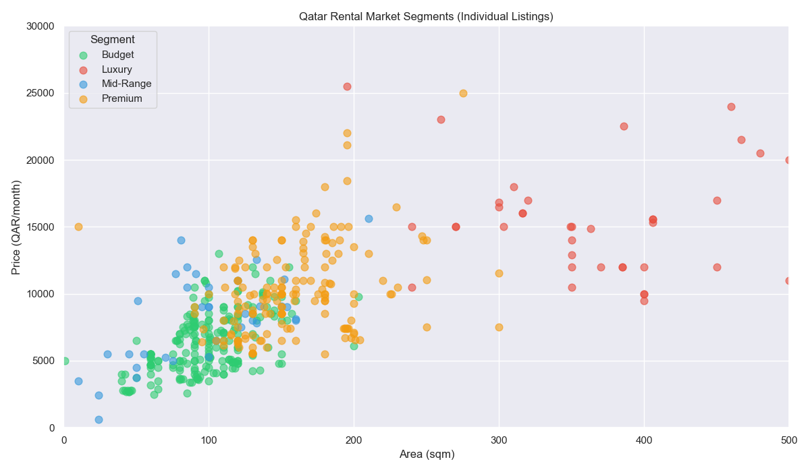
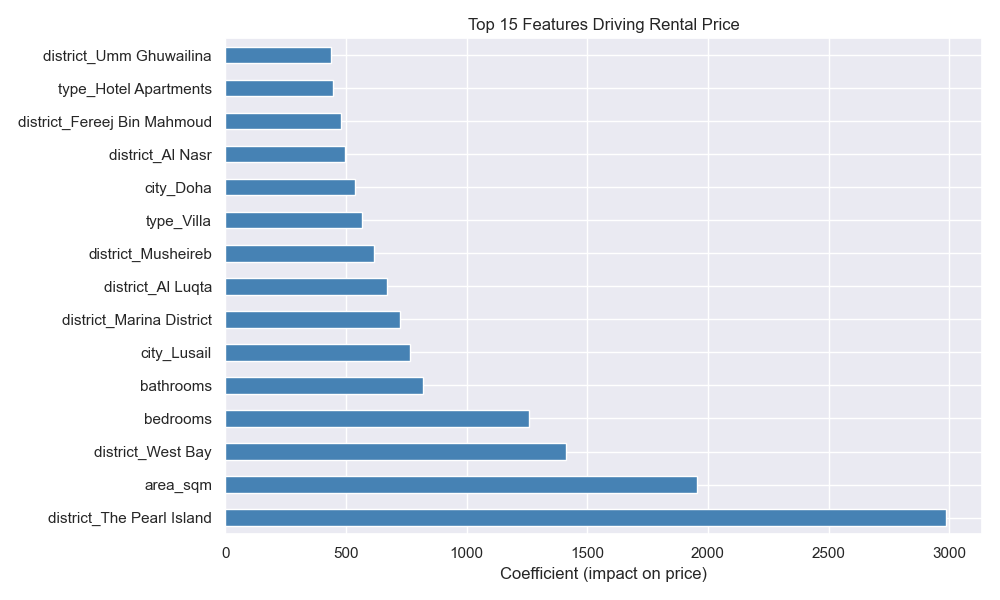
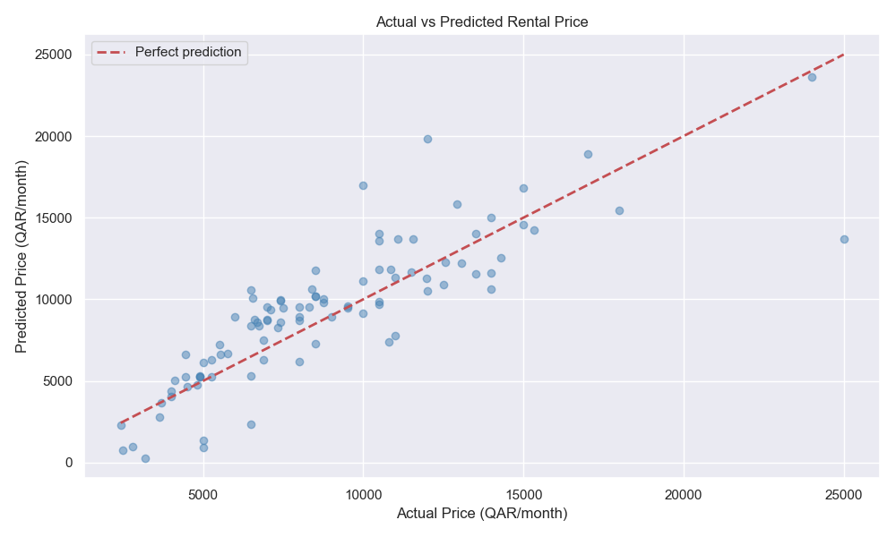

# 🏠 Qatar Rental Market Analysis — ML Project

An end-to-end machine learning project analyzing the Qatar real estate rental market using data scraped from Property Finder Qatar.

## Project Overview

This project applies three core ML techniques to real-world Qatar rental data:
- **Clustering** - Segment the market into Budget, Mid-Range, Premium and Luxury
- **Regression** - Predict rental prices based on location, size and property type
- **Classification** - Classify any listing into its market segment with 94.7% accuracy

## Key Findings

-  **The Pearl Island** adds ~3,000 QAR/month to rent just for the address
-  **Area (sqm)** is the second strongest price driver after location
-  Average rent in Qatar: **8,628 QAR/month** (median: 8,000 QAR)
-  Luxury listings average **385 sqm** and **4.3 bedrooms** ; mostly villas
-  **Lusail** commands a city-level premium over central Doha

##  Market Segments (K-Means, K=4)

| Segment | Avg Price | Avg Area | Avg Bedrooms |
|---|---|---|---|
| Budget | 6,321 QAR | 98 sqm | 1.4 |
| Mid-Range | 8,227 QAR | 97 sqm | 1.3 |
| Premium | 10,255 QAR | 159 sqm | 2.5 |
| Luxury | 17,880 QAR | 385 sqm | 4.3 |

##  Model Performance

| Model | Metric | Score |
|---|---|---|
| Ridge Regression | R² Score | 0.661 |
| Ridge Regression | MAE | 1,755 QAR |
| KNN Classifier | Accuracy | 94.7% |

##  Tech Stack

- **Python 3** — core language
- **BeautifulSoup / Requests** — web scraping
- **Pandas** — data cleaning & manipulation
- **Matplotlib / Seaborn** — visualizations
- **Scikit-learn** — ML models

##  Project Structure
```
qatar-realestate-ml/
│
├── data/
│   ├── raw_listings.csv      # Raw scraped data (504 listings)
│   └── clean_listings.csv    # Cleaned data (467 listings)
├── notebooks/
│   ├── 01_cleaning.ipynb     # Data cleaning
│   ├── 02_eda.ipynb          # Exploratory data analysis
│   ├── 03_clustering.ipynb   # K-Means market segmentation
│   ├── 04_regression.ipynb   # Price prediction
│   └── 05_classification.ipynb # Segment classification
├── scraper/
│   └── scraper.py            # Property Finder scraper

└── README.md
```

##  How to Run
```bash
# Clone the repo
git clone https://github.com/ademstiti/qatar-realestate-ml.git
cd qatar-realestate-ml

# Create virtual environment
python3 -m venv .venv
source .venv/bin/activate

# Install dependencies
pip install -r requirements.txt

# Scrape fresh data
python scraper/scraper.py

# Then run notebooks in order (01 → 02 → 03 → 04 → 05)
```

##  Visualizations

### Market Segmentation


### Price Drivers


### Model Performance
